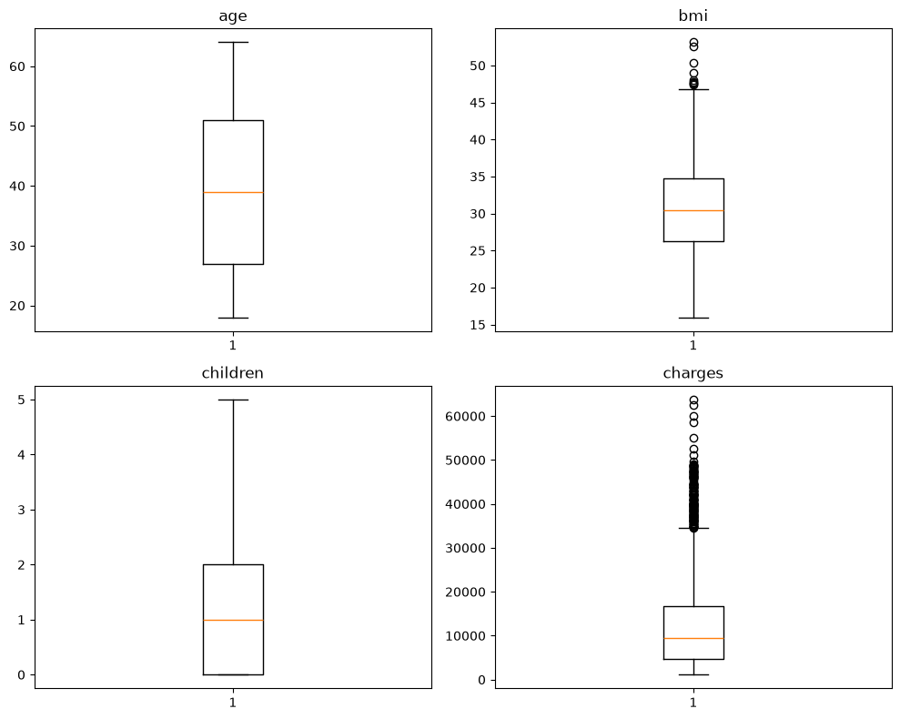
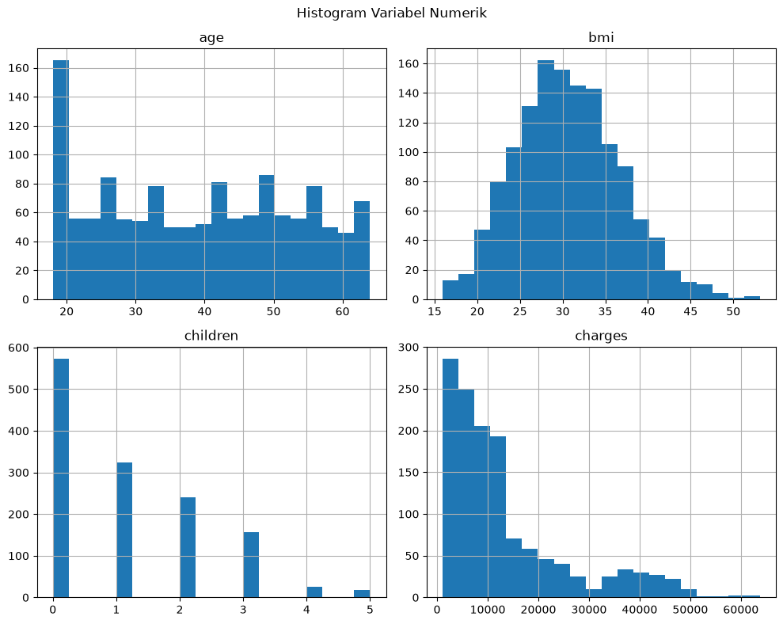

# 📊 Prediksi Biaya Medis

## 📌 Deskripsi Project
Project ini merupakan proses pembuatan model Linear Regression menggunakan **Python**. Project ini dilakukan untuk
memprediksi biaya medis berdasarkan karakteristik peserta.

## 🎯 Tujuan Project
- Menganalisis karakteristik peserta
- Membuat model Linear Regression yang stabil
- Memprediksi biaya medis berdasarkan karakteristik
- Mengevaluasi model
## 🛠 Tools yang Digunakan
- Python
- Pandas
- Scikit-Learn
- Numpy
- Matplotlib
- Seaborn
- Jupyter Notebook

## 📊 Visualisasi

### 1. Boxplot
<p align="center">
  
</p>

Boxplot menunjukkan usia dan jumlah anak tidak memiliki outlier. Sedangkan pada variabel bmi dan charges memiliki beberapa outlier.

---

### 2. Heatmap Korelasi


Heatmap menunjukkan bahwa variabel smoker memiliki korelasi postif yang paling kuat terhadap charges, diikuti oleh age dan bmi.

---

### 3. Histogram



Histogram menunjukkan bahwa distribusi age dan bmi relatif simetris, sedangkan children dan charges cenderung memiliki distribusi skew kanan.

## 📈 Hasil Evaluasi Model

| Metric | Value |
|---------|-------:|
| MAE | 4177.05 |
| MSE | 35478020.68 |
| RMSE | 5956.34 |
| R² Score | 0.8069 |


## 📂 Dataset
**Sumber Dataset:** Medical Cost Personal Dataset (Kaggle).
Dataset ini berisi 1337 peserta dengan atribut:

- age
- sex
- bmi
- children
- smoker
- region
- charges

## 🔄 Workflow:
1. Data Understanding
2. Data Preprocessing
3. Exploratory Data Analysis (EDA)
4. Feature & Target
5. Train-Test Split
6. Feature Scaling
7. Membangun Model Linear Regression
8. Prediksi
9. Evaluasi Model
10. Kesimpulan


## ✅ Hasil Project

Model Linear Regression berhasil dibangun untuk memprediksi biaya medis berdasarkan karakteristik peserta. Berdasarkan evaluasi, model memperoleh **R² Score sebesar 0.8069**, yang menunjukkan model mampu menjelaskan sekitar **80.69%** variasi data biaya medis pada dataset ini.

## 📁 Struktur Project

```
Prediksi_Biaya_Medis/
│
├── datasets/
│   └── insurance.csv
│
├── images/
│   └── boxplot.png
│   └── heatmap.png
│   └── histogram.png
├── notebook/
│   └── Mini_Project_Linear_Regression.ipynb
│
├── LICENSE
├── README.md
└── requirements.txt
```


## 🚀 Cara Menjalankan Project

1. Clone repository.
2. Install library.
```bash
pip install -r requirements.txt
```
3. Jalankan Jupyter Notebook.
```bash
jupyter notebook
```
4. Buka file `Mini_Project_Linear_Regression.ipynb`.